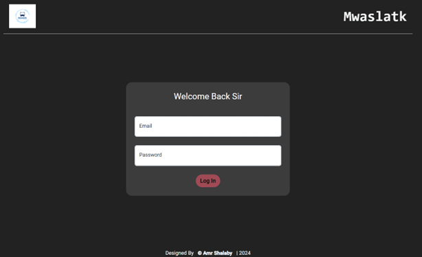
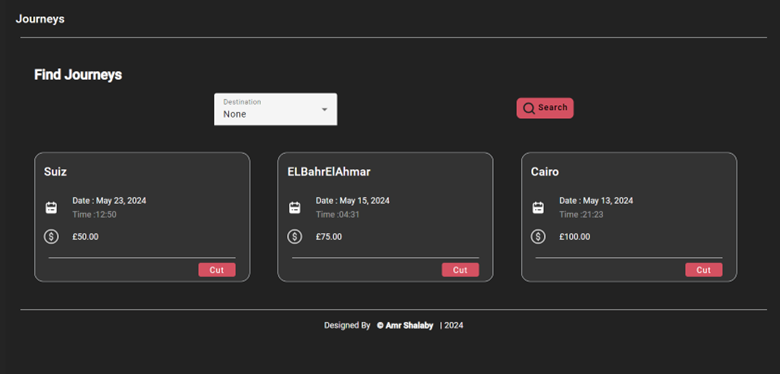
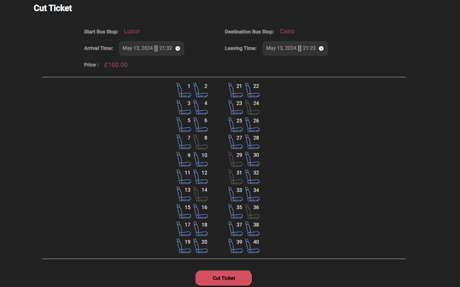
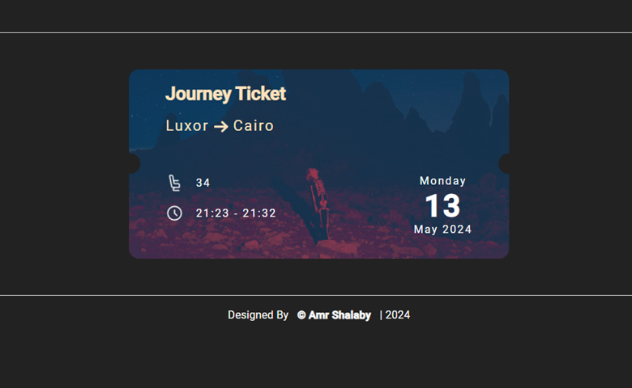
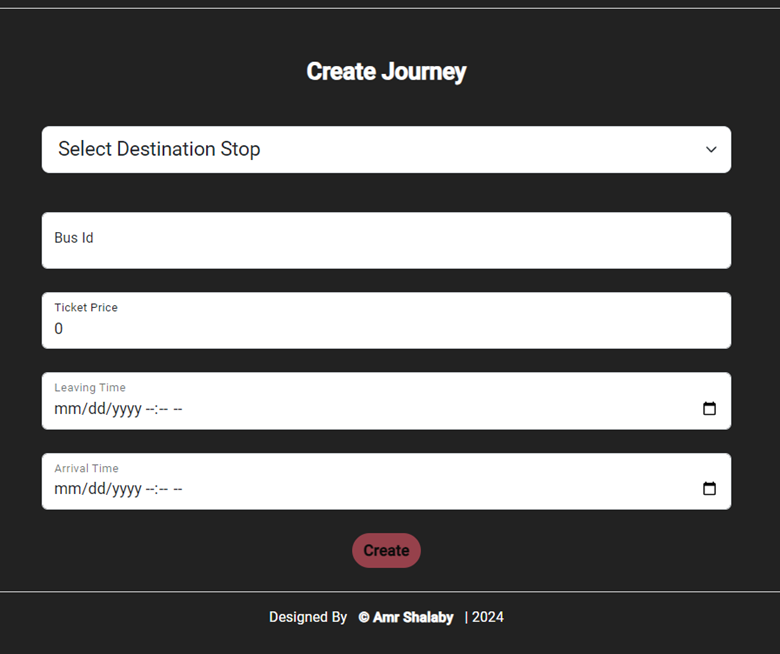
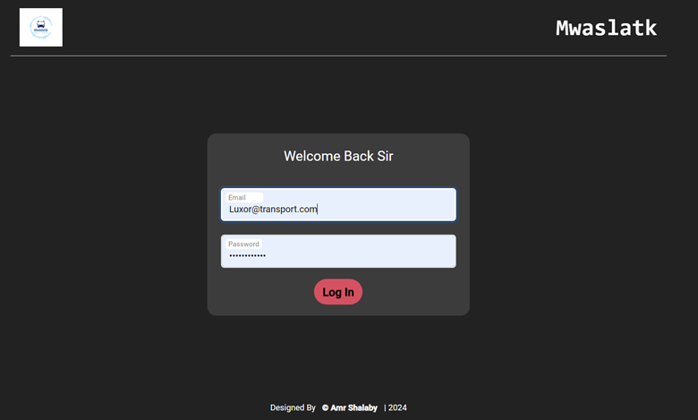
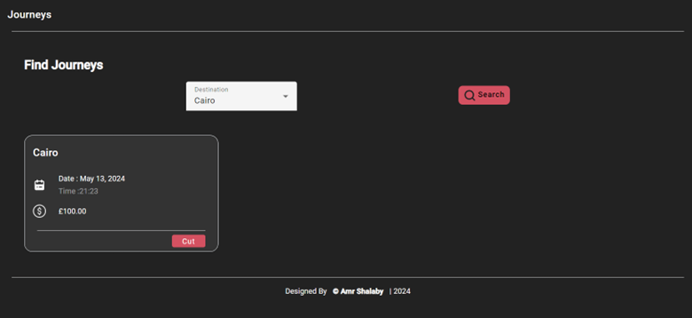
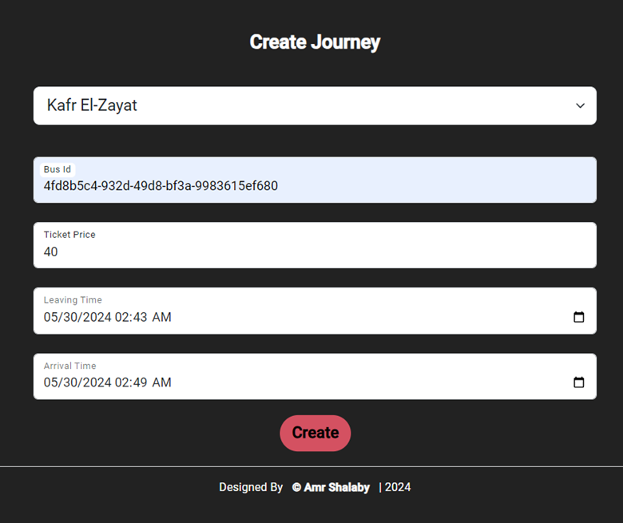

# Manager Application

## Overview
The Manager Version of the application allows managers to handle bus journey logistics, including viewing available journeys, managing tickets, and creating new journeys. This document provides an overview of the main screens and functionalities.

## Login Page
The first screen of the Manager application is the login page.

- **Login Button**: The login button is disabled until the manager enters valid input.



## Journeys Page
Upon successful login, the manager is directed to the journeys page, which displays all available journeys departing from the selected bus stop.

- **Logout Button**: A button to log out of the application.
- **Navigation Bar**: A static navigation bar on the left side of the screen with links to important pages.
- **Filter Drop-down**: A filter drop-down list to select destinations and view journeys arriving at those bus stops.



## Journey Details
When a journey is selected by clicking the "Cut" button, the detailed information about the journey is displayed.

- **Available/Not Available Seats**: The page shows which seats are available and which are not, represented graphically.
- **Cut Ticket Button**: After selecting an available seat, click this button to confirm the ticket.



## Ticket Confirmation
After successfully cutting a ticket, a new ticket with important information about the journey and the consumer's ticket is displayed.

- **All Tickets Button**: A button to display all previous tickets for all consumers.



## Create Journey
The last screen in the application is the Create Journey screen.

- **Destination Selection**: Managers can select the destination for the journey from the drop-down list.
- **Create Button**: The button is enabled after adding valid input.
- **Success Message**: A message is displayed upon successfully adding the journey.



## Features
- **Login Validation**: Ensures the manager enters valid input before enabling the login button.
- **Journey Management**: View and filter available journeys.
- **Seat Selection**: Graphical representation of available and unavailable seats.
- **Ticket Management**: Ability to view and manage tickets.
- **Journey Creation**: Easy creation of new journeys with destination selection.

## Screenshots
### Login Page



### Journeys Page



### Journey Details


### Ticket Confirmation


### Create Journey



### Installation

1. **Clone the repository**:
    ```sh
    git clone https://github.com/amr1234567/Transportation.System_Admin_Frontend_Angular.git
    ```

2. **Install NPM packages**:
    ```sh
    npm install
    ```

3. **Run the application**:
    ```sh
    ng serve
    ```
   Open your browser and navigate to `http://localhost:4200/`.

## Contributing

1. **Fork the repository**.
2. **Create a new branch**:
    ```sh
    git checkout -b feature/YourFeature
    ```
3. **Make your changes** and commit them:
    ```sh
    git commit -m 'Add some feature'
    ```
4. **Push to the branch**:
    ```sh
    git push origin feature/YourFeature
    ```
5. **Create a new Pull Request**.

## Contact
Your Name - [amr.m7md.shalaby@gmail.com](amr.m7md.shalaby@gmail.com)

All Project Link: [https://github.com/amr1234567/Transportation.Managment.System.git](https://github.com/amr1234567/Transportation.Managment.System.git)

## Acknowledgments
- Special thanks to the Angular community for the resources and support.
- Thanks to all contributors who helped improve this project.
